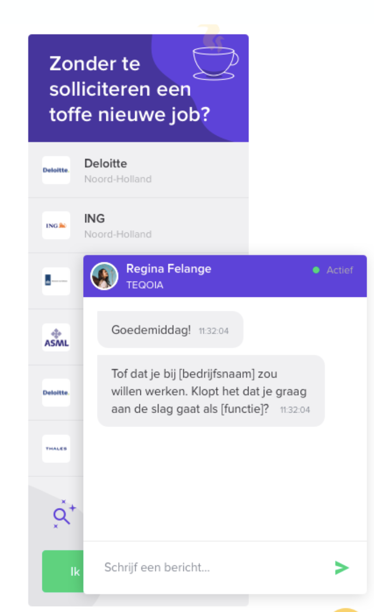

## Onderzoek Lively "Kandidaatvinden"

|  | Kandidaatvinden is een extentie waarmee bezoekers die op zoek zijn naar een baan in contact kunnen komen met een recruiter. Samen met de recruiter word door middel van een live chatgesprek een profiel opgezet, waarna de recruiter contact opneemt met het bedrijf. Hierdoor is solliciteren per definitie niet meer nodig. |
| ---------------------------------------------------- | ------------------------------------------------------------------------------------------------------------------------------------------------------------------------------------------------------------------------------------------------------------------------------------------------------------------------------ |

Aangezien Kandidaatvinden werkt met persoons gerelateerde data wordt de chat geinitialiseerd nadat er een authorisation token verstuurd wordt. De chat word hierna geëncrypt voor beveiliging.
