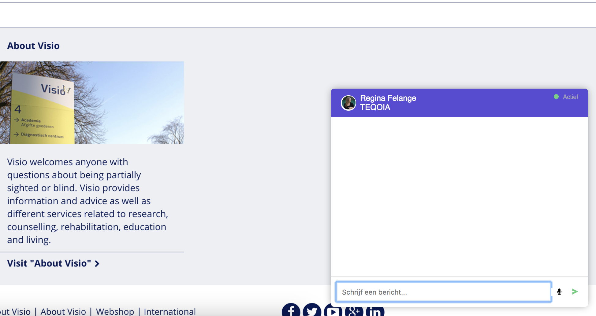

# Lifely README

[live link](https://lifelyvoicechat.herokuapp.com/)

### Kandidaatvinden

Voor lifely hebben we een extentie moeten maken voor Kandidaatvinden. Met Kandidaatvinden wordt het sollicitatie proces geëlemineerd en via een intermediar contact gezocht met een bedrijf. Zo kan je snel aan de slag bij een bedrijf zonder door het gehele proces heen te moeten.

Aangezien Kandidaatvinden werkt doormiddel van een chat ben ik gaan kijken naar welke functionaliteiten deze nog mist. Uiteindelijk ben ik me gaan focussen op de blinde gebruiker die op zoek is naar een baan door de chat voor hun toegankelijk te maken.

Een blinde gebruiker kan nu door een toetscombinatie in de microfoon van zijn of haar laptop praten waarna deze opname wordt omgezet naar text. Berichten die binnenkomen worden voorgelezen door de stem in de computer. Hierdoor kan een blind persoon gewoon een gesprek voeren met de intermediar.

[Onderzoek Kandidaatvinden](./Onderzoek.md)
